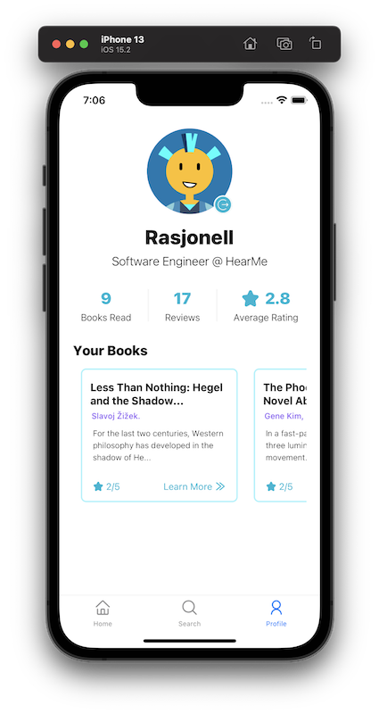
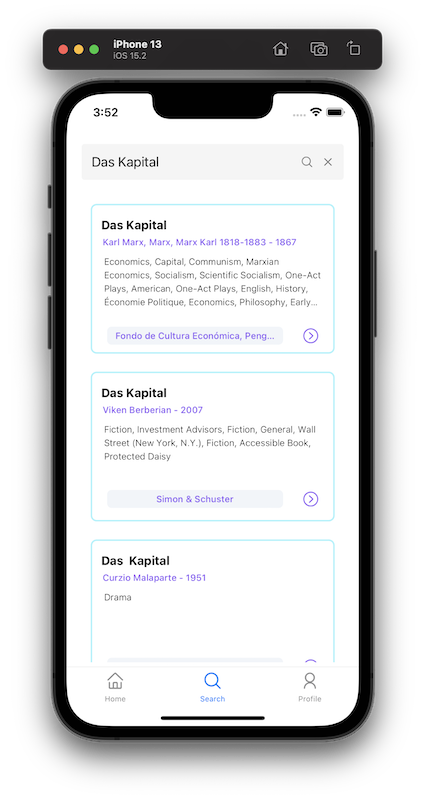
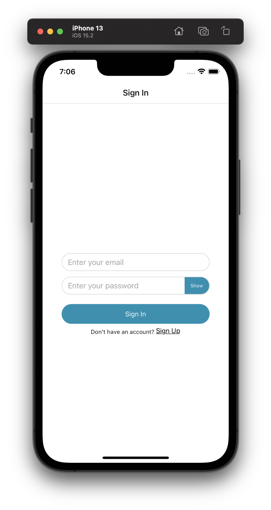
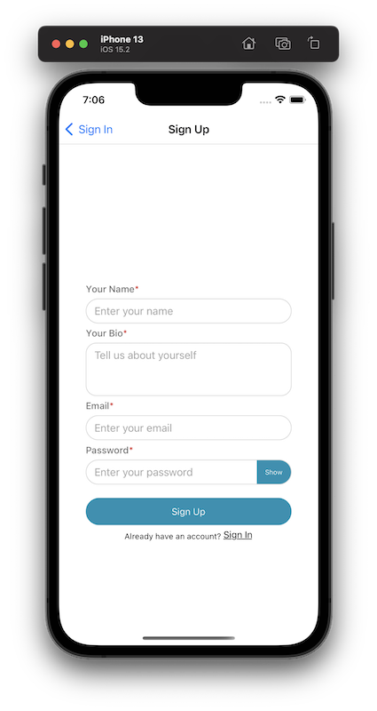

# X-Library Mobile

Cross-Platform Mobile Client for the [X-Library](https://github.com/rasjonell/x-library) Self-Hosted, Open, and Editable Library Management Platform

# Development

- Follow the [X-Library Setup Guide](https://github.com/rasjonell/x-library#setup) to have a functional Phoenix server running.
- Copy and rename `.env.example` to `.env` and follow the example to setup your environment variables.
- Setup X-Library Mobile
  - `git clone https://github.com/rasjonell/x-library-mobile`
  - `cd x-library-mobile`
  - `yarn`
  - Take a coffee break while it installs the dependencies.
  - `npx pod-install`
  - `yarn start`
- Now You can run the app in a simulator
  - `yarn ios`
  - `yarn android`

# Available Screens

Profile             |  Search
:-------------------------:|:-------------------------:
  |  

## Authentication

Sign In             |  Sign Up
:-------------------------:|:-------------------------:
  |  